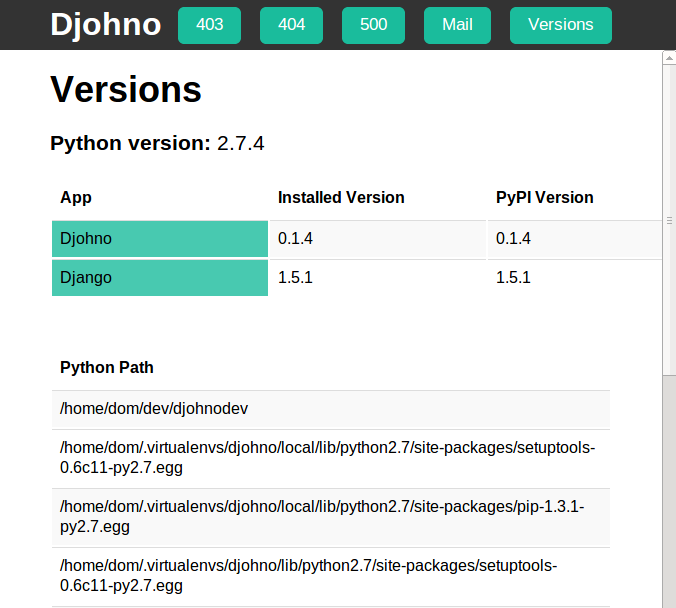
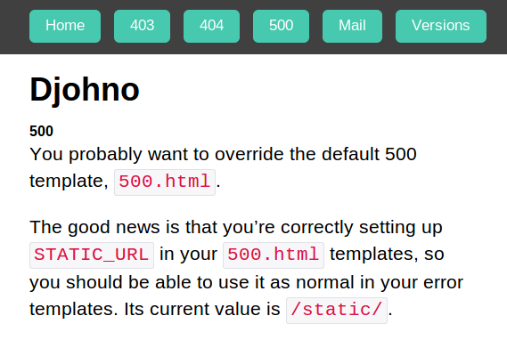
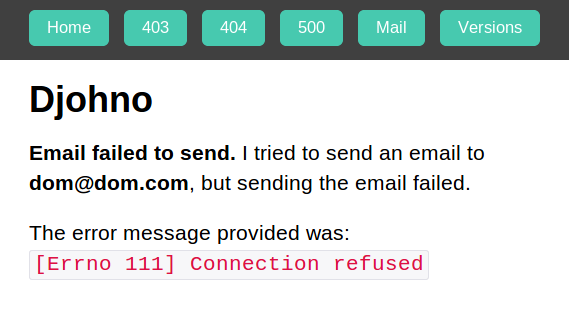

Screenshots of djohno
=====================

Version checks
--------------

   Djohno's version page shows you what versions of apps in
   ``INSTALLED_APPS`` you've got installed, along with your Python
   path and your Python version.

Error checks
------------

   Djohno's 500 test page allows you to test your error logging, and
   the display of your ``500.html`` error page. It even helps by
   warning you about whether you've got ``STATIC_URL`` set up.

Mail checks
-----------

   Djohno's mail test page attempts to send an email address to
   whatever address the logged in user has set up.
